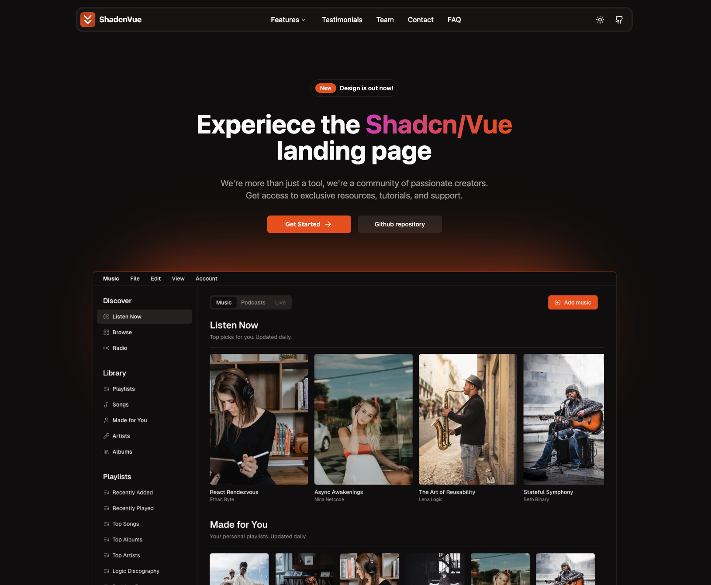

# Quiz9 - Test your knowledge


Live demo is now available: <a href="https://shadcn-vue-landing-page.vercel.app" target="_blank">Live Demo</a>

## Sections

- [x] Navbar
- [x] Sidebar(mobile)
- [x] Hero
- [x] Sponsors
- [x] Benefits
- [x] Features
- [x] Testimonials
- [x] Pricing
- [x] Frequently Asked Questions(FAQ)
- [x] Team
- [x] Footer
- [ ] ... More Sections Coming Soon

## Features

- [x] Fully Responsive Design
- [x] User Friendly Navigation
- [x] Dark Mode

## How to install

1. Clone this repositoy:

```bash
git clone https://github.com/leoMirandaa/shadcn-vue-landing-page.git
```

2. Go into project

```bash
cd shadcn-vue-landing-page
```

3. Install dependencies

```bash
npm install
```

4. Run project

```bash
npm run dev
```
